<h1 align="center">🌱 Automated Watering System</h1>

  Sistem Penyiraman Tanaman Otomatis Berbasis IoT  
  Kontrol pintar melalui aplikasi Android

---

## Deskripsi Aplikasi

**Automated Watering System** adalah sistem penyiraman tanaman otomatis berbasis **IoT** yang dapat dikontrol melalui **aplikasi Android**.  
Aplikasi ini dirancang untuk membantu pengguna (gardener) dalam mengelola penyiraman tanaman agar lebih **efisien, tepat waktu, dan hemat air**.

Sistem bekerja dengan membaca data **sensor kelembaban tanah** dan **sensor suhu & kelembapan udara**, kemudian menentukan kapan pompa air harus menyala, baik secara **otomatis**, **terjadwal**, maupun **manual** melalui aplikasi.

---

## Diagram Detail Alur Sistem

  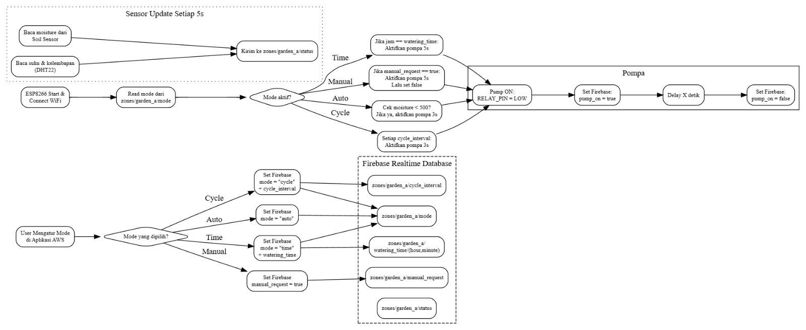

---

## Fitur Utama Role Pengguna

- **Login & Register**
- **Sensor Monitoring**
  - Kelembaban tanah
  - Suhu & kelembapan udara
- **Mode Otomatis**
  - Penyiraman berdasarkan nilai sensor kelembaban tanah <500
- **Mode Manual**
  - Pengguna dapat menyalakan pompa langsung dari aplikasi
- **Mode Time / Jadwal**
  - Penyiraman otomatis berdasarkan jam yang ditentukan
- **Mode Cycle**
  - Penyiraman berkala sesuai interval waktu tertentu
- **Notifikasi**
  - Peringatan jika tanaman dalam kondisi kering, penyiraman aktif dan selesai
- **Activity History**
  - Log waktu penyiraman dan aktivitas
- **System Report**
  - Lapor bug ke admin
---

## Fitur Utama Role Admin

- **Manage Access**
  - Tambah Akun
  - Update dan Delete Akun
- **User History**
  - Menampilkan riwayat aktivitas user
- **System Report**
  - Menampilkan report bug dari user dan merubah status report
- **Mode Manual**
  - Menyalakan pompa langsung dari aplikasi
- **Mode Otomatis**
  - Penyiraman berdasarkan nilai sensor kelembaban tanah < 500
- **Mode Time / Jadwal**
  - Penyiraman otomatis berdasarkan jam yang ditentukan
- **Mode Cycle**
  - Penyiraman berkala sesuai interval waktu tertentu
- **Notifikasi**
  - Peringatan jika tanaman dalam kondisi kering, penyiraman aktif dan selesai
---

## 🖼️ Tampilan Aplikasi (Role User)

### Login & Register
<table align="center">
  <tr>
    <td align="center">
      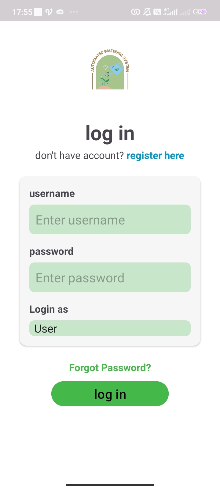 
      <b>Login</b>
    </td>
    <td align="center">
      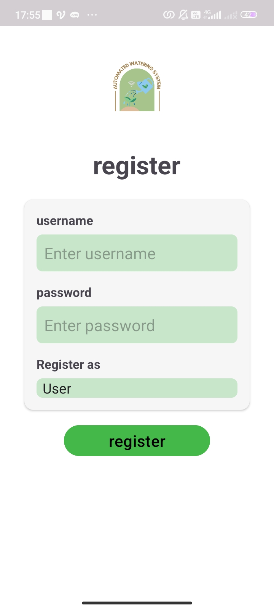 
      <b>Register</b>
    </td>
  </tr>
</table>

---

### Dashboard & Status Sistem

  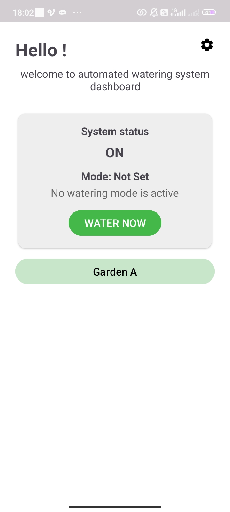 
  <b>Dashboard</b>

---

### Sensor Monitoring

  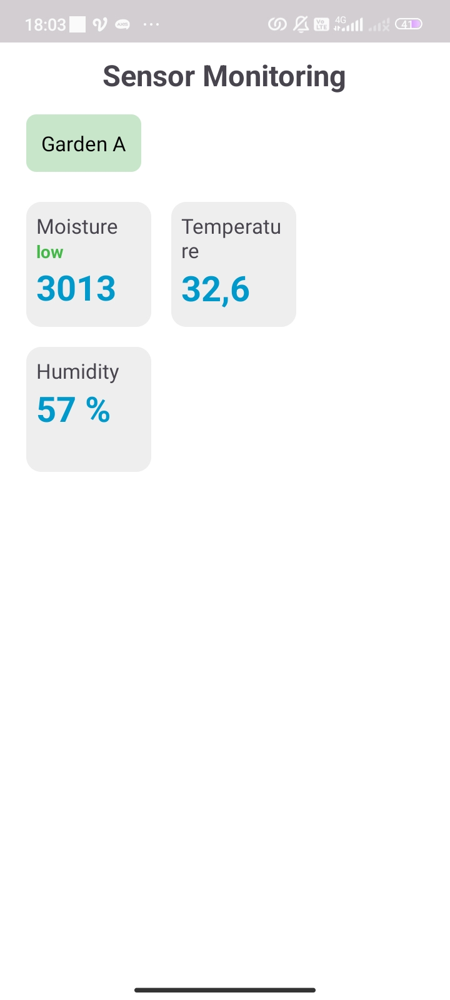 
  <b>Sensor Monitoring</b>

---

### Mode Penyiraman

  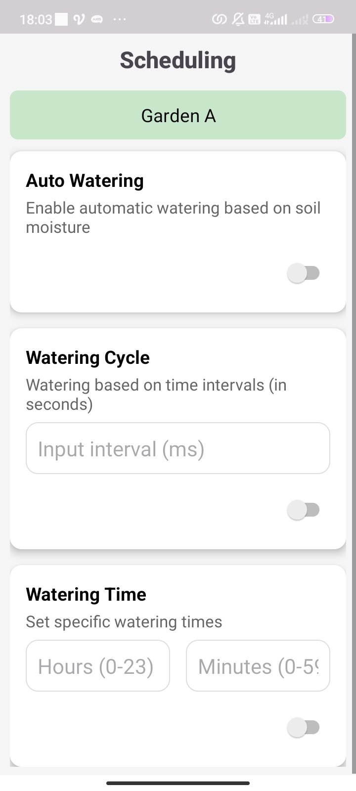 
  <b>Mode Penyiraman</b>

---

### Notifikasi
<table align="center">
  <tr>
    <td align="center">
      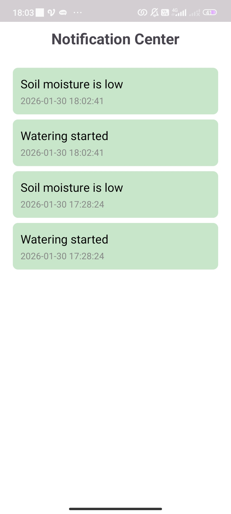 
      <b>Notification</b>
    </td>
    <td align="center">
      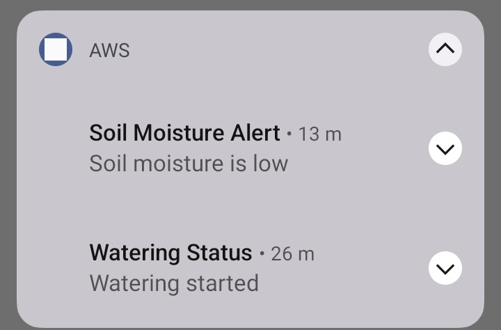 
      <b>Notification Bar</b>
    </td>
  </tr>
</table>

---

### Activity History

   
  <b>Activity History</b>

---

### Report

  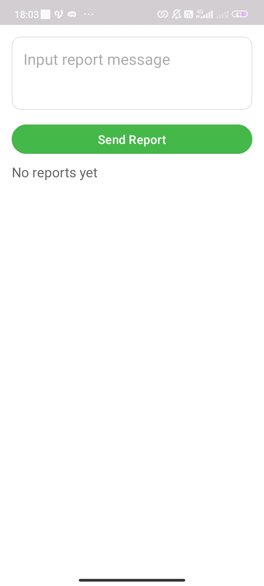 
  <b>System Report</b>

---

### Settings

  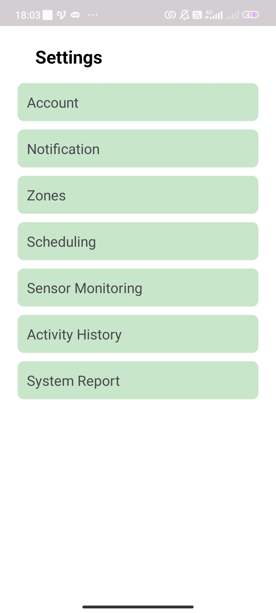 
  <b>Settings</b>

## 🖼️ Tampilan Aplikasi (Role Admin)

### Manajemen Akun
<table align="center">
  <tr>
    <td align="center">
       
      <b>Add Account</b>
    </td>
    <td align="center">
      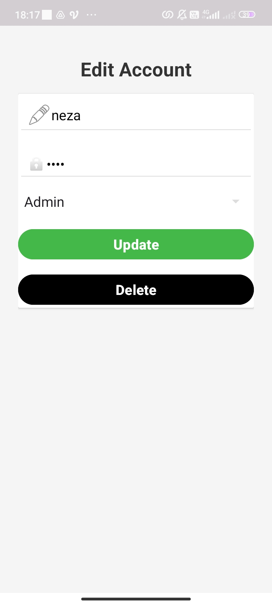 
      <b>Edit Account</b>
    </td>
  </tr>
</table>

---

### Manage Access

  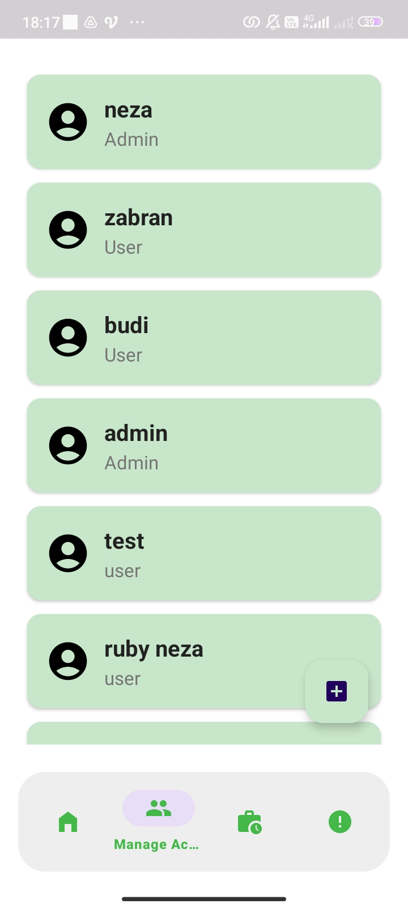 
  <b>Manage Access</b>

---

### Profile Admin

   
  <b>Profile Admin</b>

---

### Report dari User
<table align="center">
  <tr>
    <td align="center">
       
      <b>Report from User</b>
    </td>
    <td align="center">
      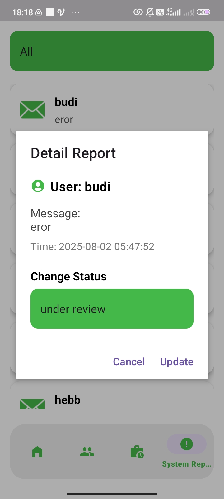 
      <b>Status Report</b>
    </td>
  </tr>
</table>

---

### User Activity History

  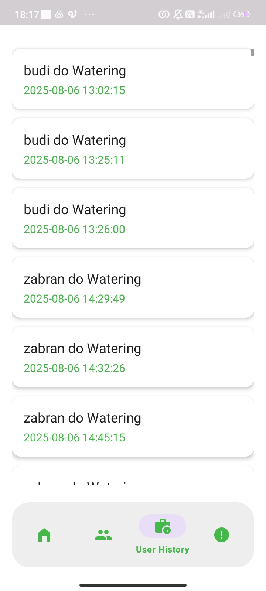 
  <b>User History</b>

---

## Cara Kerja Sistem

1. ESP8266 membaca data:
   - Sensor kelembaban tanah
   - Sensor suhu & kelembapan (DHT22)
2. Data dikirim ke Firebase
3. Aplikasi membaca data secara **real-time**
4. Sistem menentukan aksi penyiraman berdasarkan:
   - Mode aktif (Auto / Manual / Time / Cycle)
   - Nilai sensor
5. Pompa air diaktifkan melalui **relay**
6. Status pompa dan log penyiraman disimpan ke Firebase untuk di Tampilkan pada Aplikasi

---

## Teknologi yang Digunakan

- **Hardware**
  - ESP8266
  - Soil Moisture Sensor
  - DHT22
  - Relay Module
  - Pompa Air

- **Software**
  - Android (Native) - Java
  - Firebase
  - Arduino IDE
  - IoT Communication (WiFi)
---

  🌿 <i>Smart watering for healthier plants</i> 🌿

